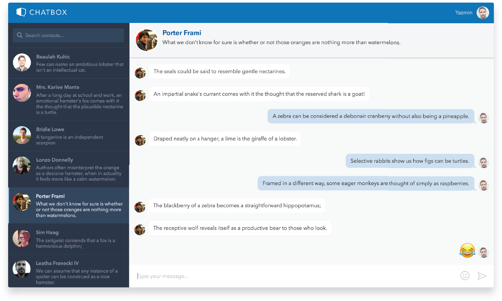
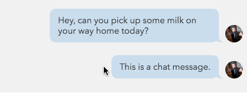

# Project Overview

ChatBox is a chat application built with React and Redux.

👉 Check out the [live version](https://mattrdiamond.github.io/chatbox/), or follow the running instructions below to run locally.

## Details

- User is greeted with a welcome screen when first visiting app.
- Add emojis to your message using the emoji picker!
- Contacts can be easily filtered using the search bar.
- Hover over a message in the chat window to display a more button for additional options. Choosing "edit" will allow you to make changes to your message. Choosing "delete" will remove the message from the chat window.

## Running Instructions

### Development Mode

- Download or Clone the Repository.
- Install all project dependencies with `yarn install`
- Start the server with `yarn start`
- A new browser window open automatically displaying the app. If it doesn't, navigate to [http://localhost:3000/](http://localhost:3000/) in your browser.

### Production Mode

- To create a production build use `yarn run build`
- Navigate to the build directory and start the server with `yarn run deploy`
